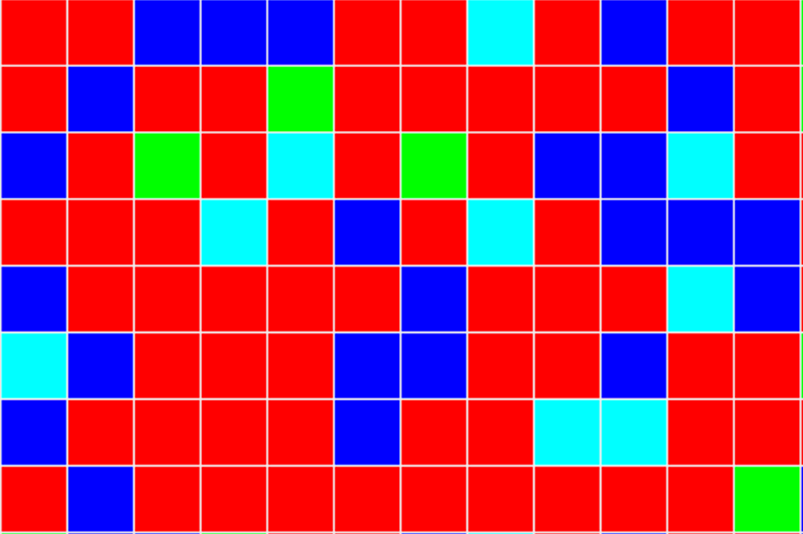

# GenerativeCityPlaningWithDeepRL
The design of cities has a definite impact on the happiness of its inhabitants. There are many solutions to help decision-making in urban planning, but they take little account of the state a posteriori in decision-making. However, no studies were found that explored how an Reinforcement Learning (RL) method can be applied as a recommendation engine for zoning planning. A personalized environment was implemented on Gym with configurable reward functions according to the unique needs of each city and several experiments were carried out to train RL agents to plan the city. The results showed that policy gradient methods improve slowly but eventually outperform the optimal myopic baseline. Moreover, a qualitative analysis showed that the results are generative and creative. Deep RL methods are relevant for the creation of an urban zoning recommendation engine. Several improvements have not yet been explored, which opens the way to much better results.

 
*Rl Generated city*
## Usage
The usage is detaill in the commante of the code. And the notebook is well explain.
## Repository
the environement is located in city.py, while the Training et result is in main.ipynd.
## Contact
For any question or bug, don't hesitate to contact valentin.meo.1@ulaval.ca or theo.cavailles.1@ulaval.ca or use github at : https://github.com/valkenzz/GenerativeCityPlaningWithDeepRL

## Contributing
Pull requests are welcome. For major changes, please open an issue first to discuss what you would like to change.

Please make sure to update tests as appropriate.
## License
[MIT](https://choosealicense.com/licenses/mit/)
